# To-do app

## Description
This is a simple and responsive To-Do application built with React and TypeScript. It allows users to add, edit, delete, mark tasks as completed and sort them by their status (all tasks, pending tasks, completed tasks). The application also persists data using the browser's local storage. Designed as a portfolio project, it demonstrates proficiency in state management, component design, and local data handling in a modern web development environment.

## Technologies
- HTML
- Sass
- TypeScript
- React

## How to Run
1. Clone the repository:
   ```bash
   git clone https://github.com/KreimerR/to-do-app.git
   ```

2. Navigate to the project folder:
   ```bash
   cd to-do-app
   ```

3. Install npm packages:
  ```bash
  npm install
  ```

4. Start the development server:
   ```bash
   npm run dev
   ```

## Features
- Add new tasks
- Delete existing tasks
- Edit task titles
- Mark tasks as completed or revert to pending
- Sort tasks by status: all, pending, or completed

## Screenshots
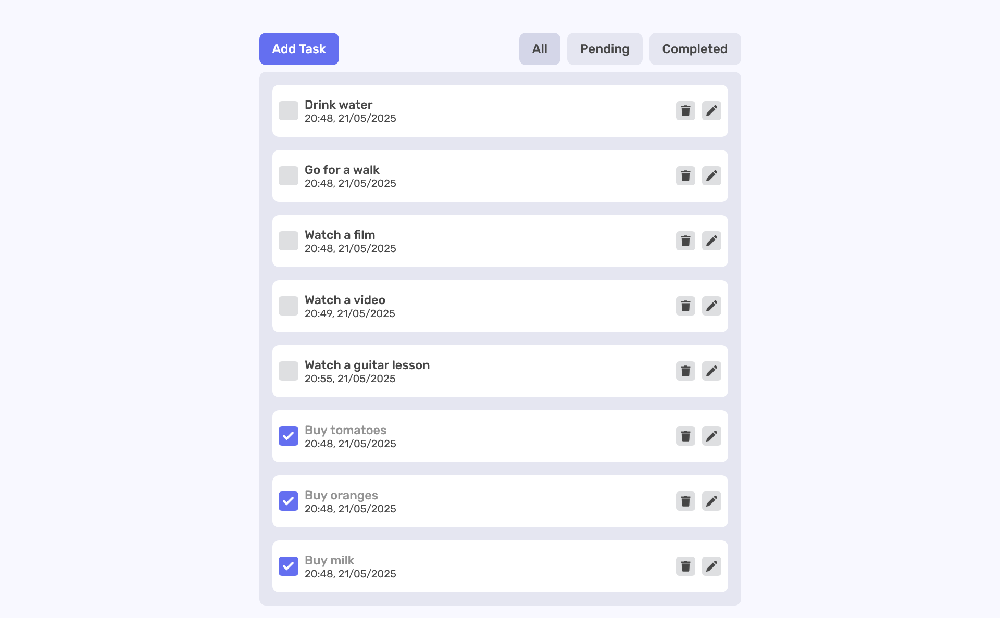
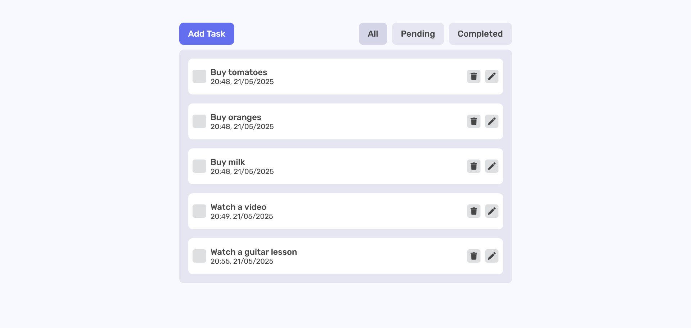
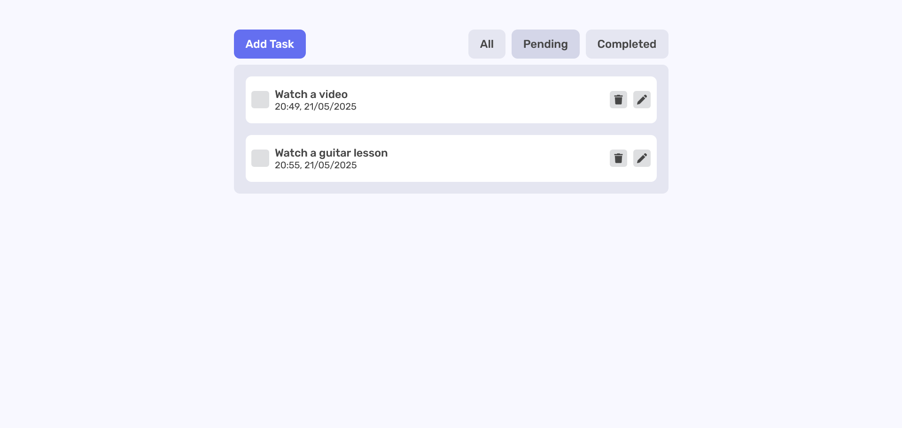
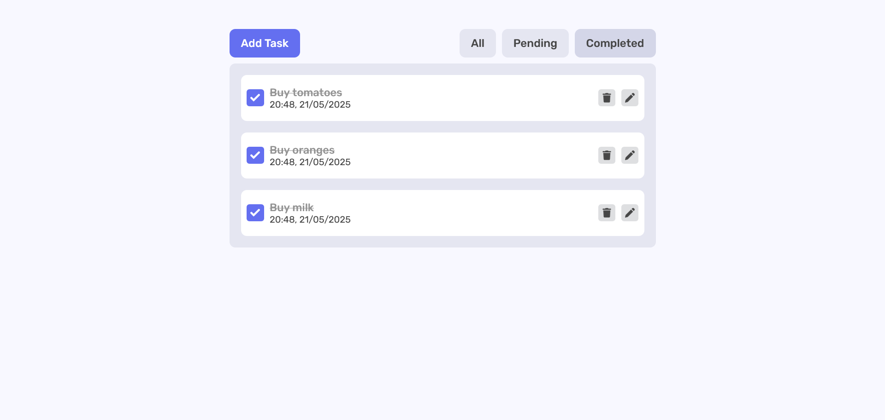
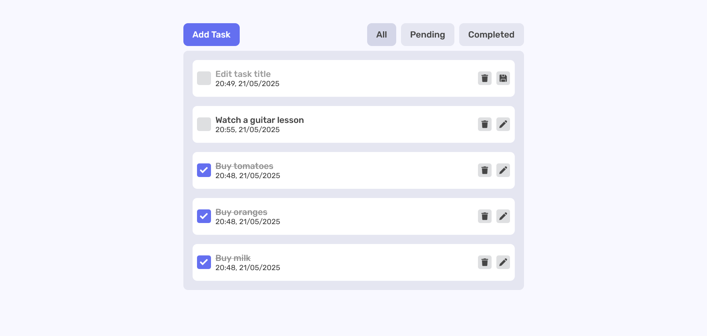
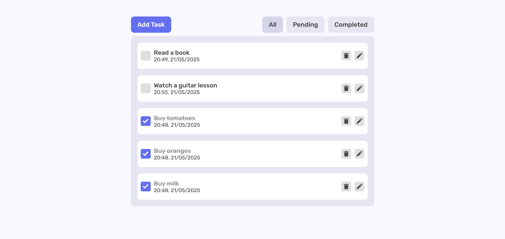
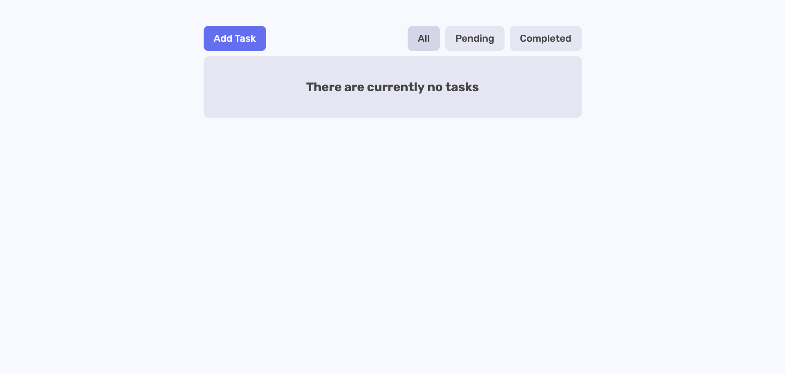
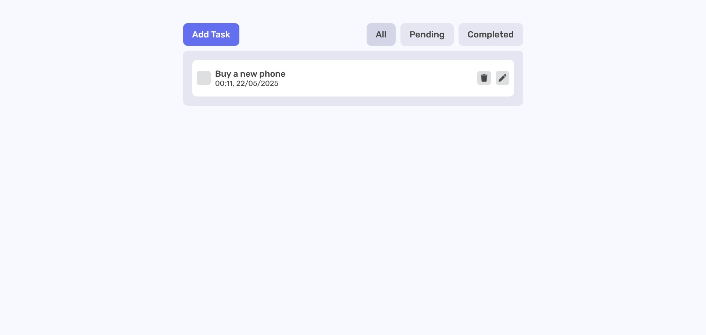
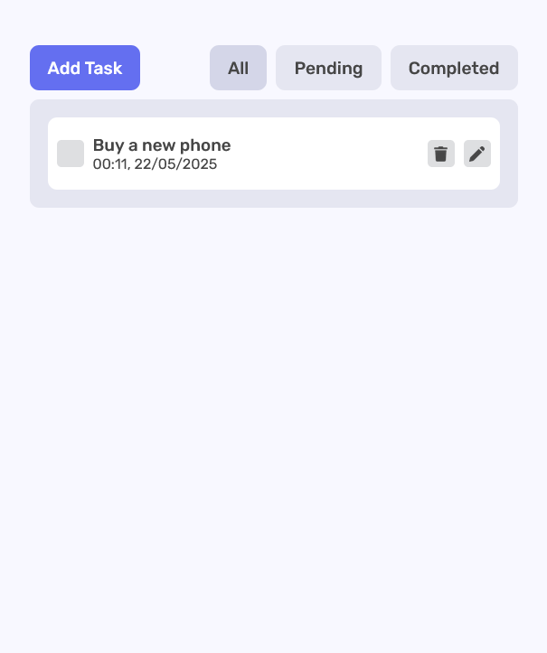
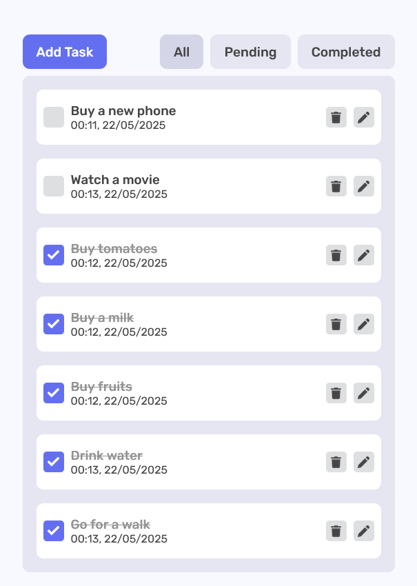
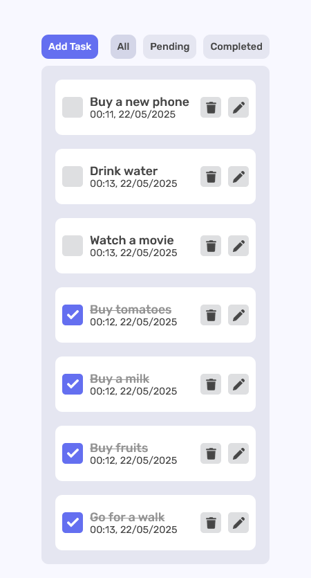